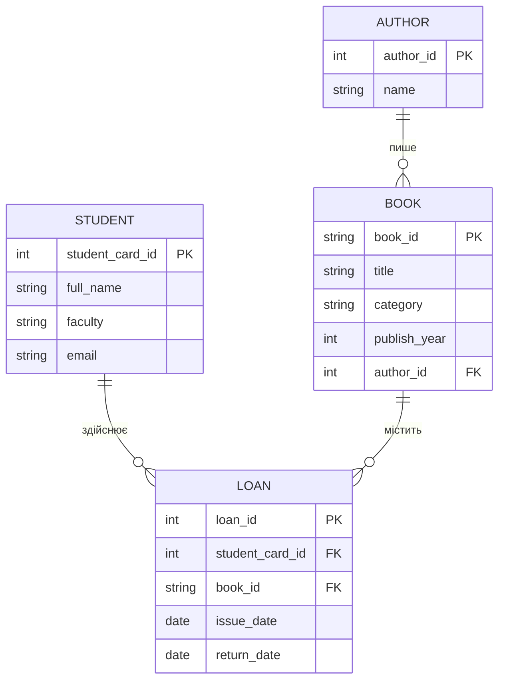

# Студентська бібліотека: облік літератури та читацьких формулярів
---
## Система призначена для автоматизації обліку бібліотечного фонду університету та управління процесом видачі літератури студентам. 

---

### Потреби зацікавлених сторін

Студенти (читачі):
* бути зареєстрованими у системі
* брати книги у бібліотеці
* повертати книги після прочитання

Бібліотекарі / Адміністратори:
* вести каталог книг та їх авторів
* реєструвати нових студентів
* фіксувати факт видачі книги конкретному студенту
* фіксувати факт повернення книги
* відстежувати боржників (тих, хто не повернув книги)
---
### Система повинна зберігати:

* інформацію про студентів (читачів)
* інформацію про книги та їх авторів
* інформацію про історію видачі та повернення літератури

---

### Бізнес-правила:

* Кожна книга ідентифікується унікальним номером.
* Один автор може написати декілька книг, які зберігаються у фонді.
* Один студент може одночасно взяти кілька різних книг.
* Одна й та сама книга може видаватися різним студентам, але у різні проміжки часу.
* Факт видачі фіксується створення нового запису у формулярі (Loan) із зазначенням дати видачі.
* Факт повернення фіксується шляхом додавання дати повернення у відповідний запис формуляра.
---
## ER-діаграма
**ER-модель складається з чотирьох сутностей:** Student,Book, Author, Loan 
Зв’язок між Student та Book є багато-до-багатьох, який реалізується через проміжну (асоціативну) сутність Loan.

---
## Сутності та атрибути
### Сутність: **Student**

| Атрибут | Опис |
| :--- | :--- |
| student_card_id (PK) | Унікальний номер читацького квитка |
| full_name | ПІБ студента |
| faculty | Назва факультету |
| email | Контактна електронна адреса |

### Сутність: **Author**

| Атрибут | Опис |
| :--- | :--- |
| author_id (PK) | Внутрішній ідентифікатор автора |
| name | ПІБ або псевдонім автора |

### Сутність: **Book**

| Атрибут | Опис |
| :--- | :--- |
| book_id (PK) | Унікальний міжнародний номер книги |
| title | Назва книги |
| category | Категорія або жанр літератури |
| publish_year | Рік видання |
| author_id (FK) | Посилання на автора книги (зовнішній ключ) |

### Сутність: **Loan**

| Атрибут | Опис |
| :--- | :--- |
| loan_id (PK) | Унікальний ідентифікатор транзакції видачі |
| student_card_id (FK) | Студент, який взяв книгу |
| book_id (FK) | Книга, яку було видано |
| issue_date | Дата видачі книги |
| return_date | Дата фактичного повернення книги (може бути порожнім) |

---

## Пояснення зв'язків

**Author - Book**
* Тип: один-до-багатьох
* Один автор може написати багато книг.
* Кожна книга у цій моделі належить лише одному основному автору.

**Student - Loan**
* Тип: один-до-багатьох
* Один студент може мати багато записів про позичені книги (багато формулярів).
* Кожен запис про видачу належить тільки одному студенту.

**Book - Loan**
* Тип: один-до-багатьох
* Одна книга може мати багато записів в історії видач (її брали різні люди).
* Кожен запис про видачу стосується лише однієї конкретної книги.

**Student - Book**
* Тип: багато-до-багатьох
* Реалізується через таблицю Loan.
---
### *Припущення та обмеження*
*У цій версії припускається, що у книги є лише один основний автор (для спрощення схеми).
Дата повернення (return_date) може бути порожньою (NULL). Якщо вона порожня - книга вважається такою, що знаходиться "на руках" у студента.
Система веде облік видань за унікальним номером. Ми не відстежуємо фізичний стан кожного окремого екземпляра (наприклад, пошкодження сторінок).
Видалення студента з бази можливе лише за умови, що він повернув усі книги (обмеження зовнішнього ключа).
Видалення книги з бази автоматично видаляє історію її видач (cascade delete).*
