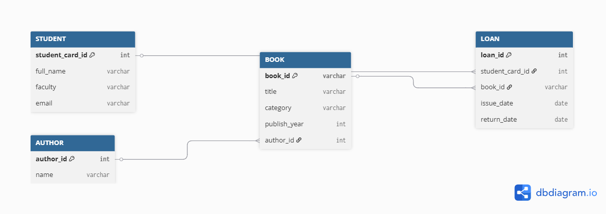

# Лабораторна робота №5 | Нормалізація бази даних

## 1. Початкова схема (Ненормалізована форма - UNF)
Уявімо, що початковий дизайн бази складався лише з однієї загальної таблиці `LIBRARY_LOG`, куди записувалася вся інформація підряд.

**Схема:** `LIBRARY_LOG` ( `student_card_id`, `full_name`, `faculty`, `email`, `book_id`, `title`, `author_name`, `issue_date` )

**Проблеми:**
* **Аномалія вставки:** Неможливо додати нову книгу в базу, поки її не візьме якийсь студент (бо `student_card_id` є частиною ключа).
* **Аномалія оновлення:** Якщо студент змінить пошту, доведеться оновлювати всі його записи про видачу книг.

## 2. Функціональні залежності (ФЗ)
Згідно з вимогами, визначаємо повний набір функціональних залежностей для початкової (ненормалізованої) схеми `LIBRARY_LOG`:

**Залежності атрибутів студента (Часткова залежність від складеного ключа):**
1. `student_card_id` $\rightarrow$ `full_name`
2. `student_card_id` $\rightarrow$ `faculty`
3. `student_card_id` $\rightarrow$ `email`
*Узагальнено:* `student_card_id` $\rightarrow$ {`full_name`, `faculty`, `email`}

**Залежності атрибутів книги (Часткова залежність від складеного ключа):**

4. `book_id` $\rightarrow$ `title`
5. `book_id` $\rightarrow$ `category`
6. `book_id` $\rightarrow$ `publish_year`
*Узагальнено:* `book_id` $\rightarrow$ {`title`, `category`, `publish_year`, `author_name`}

**Транзитивна залежність (залежність між неключовими атрибутами):**

7. `title` $\rightarrow$ `author_name` (Ім'я автора залежить від конкретної книги, а в ідеалі — від `author_id`, якого в початковій схемі ще не було).

**Повна функціональна залежність (від усього первинного ключа):**

8. (`student_card_id`, `book_id`, `issue_date`) $\rightarrow$ `return_date`
(Тільки знаючи, ЯКИЙ студент, ЯКУ книгу і КОЛИ взяв, ми можемо визначити дату її повернення).

## 3. Етапи нормалізації

### Перехід до 1NF (Перша нормальна форма)
**Вимога:** Усі атрибути є атомарними (без списків та масивів). 
Наша таблиця `LIBRARY_LOG` вже містить єдині значення в кожній клітинці, тому вона відповідає 1NF. Ключем стає комбінація (`student_card_id`, `book_id`).

### Перехід до 2NF (Друга нормальна форма)
**Вимога:** Усунення часткових залежностей (коли поле залежить лише від частини ключа).

**Рішення:** Дані студента залежать лише від `student_card_id`, а дані книги — від `book_id`. 

Розбиваємо на три таблиці:
1. `STUDENT` (`student_card_id`, `full_name`, `faculty`, `email`)
2. `BOOK_INFO` (`book_id`, `title`, `author_name`)
3. `LOAN` (`student_card_id`, `book_id`, `issue_date`)

### Перехід до 3NF (Третя нормальна форма)
**Вимога:** Усунення транзитивних залежностей (коли неключове поле залежить від іншого неключового).

**Рішення:** У таблиці `BOOK_INFO` поле `author_name` залежить від автора, а не від ID книги. Виносимо авторів в окрему таблицю `AUTHOR` і зв'язуємо їх.

## 4. Команди для переходу до нормалізованої схеми (ALTER TABLE)
Нижче наведено DDL-команди, які демонструють перетворення таблиці `BOOK_INFO` у 3NF.

**4.1. Створення таблиці авторів:**
```sql
CREATE TABLE AUTHOR (
    author_id SERIAL PRIMARY KEY,
    name VARCHAR(255) NOT NULL
);
```

## 5. ER-діаграма

Нижче наведено діаграму, яка відображає нормалізовану структуру бази даних з усіма атрибутами та зв'язками.


